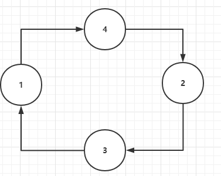
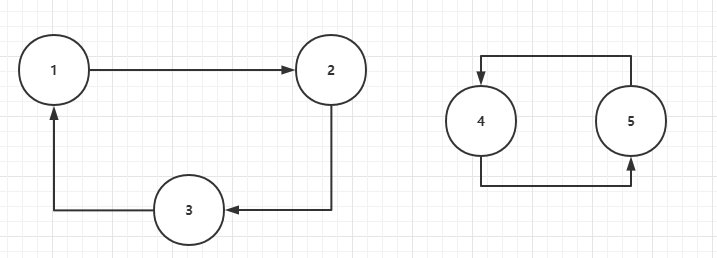

---
[SCOI2009] 游戏
---

## Problem

> windy学会了一种游戏。
>
> 对于 11 到 N 这 N 个数字，都有唯一且不同的1到N的数字与之对应。
>
> 最开始 windy 把数字按顺序 1，2，3，⋯，N 写一排在纸上。
>
> 然后再在这一排下面写上它们对应的数字。
>
> 然后又在新的一排下面写上它们对应的数字。
>
> 如此反复，直到序列再次变为 1，2，3，，N
>
> 如： 1 2 3 4 5 6123456 对应的关系为
>
> 1->2, 2->3, 3->1, 4->5, 5->4, 6->61−>2,2−>3,3−>1,4−>5,5−>4,6−>6。
>
> windy的操作如下

```txt
1 2 3 4 5 6

2 3 1 5 4 6

3 1 2 4 5 6

1 2 3 5 4 6

2 3 1 4 5 6

3 1 2 5 4 6

1 2 3 4 5 6
```

> 这时，我们就有若干排 1 到 N 的排列，上例中有 7排。
>
> 现在 windy 想知道，对于所有可能的对应关系，有多少种可能的排数。

## 输入描述

> 输入一个整数，N（1≤N≤1000）

## 输出描述

> 输出一个整数，可能的排数。

## 输入输出样例

### 示例 1

> 输入

```txt
10
```

> 输出

```txt
16
```

### 运行限制

> - 最大运行时间：1s
> - 最大运行内存: 128M

## Tag

> - 动归
> - 数论

## Solution

> 这道题对于非ACM选手的上手难度还是蛮大的，不参考题解笔者基本上是束手无策，即便研究题解也是颇费心神才能勉强理解其内涵，整合思路如下：
>
> - 首先问题的第一个转向是如何确定一个数经过一系列变换后能够回到原数，注意题目原文有一句：对于1到N这N个数字，都有唯一且不同的1到N的数字与之对应，也就是说，如果构建一张图，以数字为点，转化关系为边，共有n个点n条边，且每个点入度和出度均为1，即每个点只与另外两个点相连
>
>   - 得到小结论：这是一张由环（或单独的点）构成的图，那么一个数必定能转化回原数 
>
>   - 举例说明：
>
>     如果存在这样一条环路的话，经过N=4次变换必然可以回到原序列
>
>     > 1 2 3 4				0
>     >
>     > 4 3 1 2				1
>     >
>     > 2 1 4 3				2
>     >
>     > 3 4 2 1				3
>     >
>     > 1 2 3 4				4
>
>   - 不难看出，由两个含有a, b个数字的可转化序列（环）所组成的序列，回到原状态需要LCM（a,b）（最小公倍数）行
>
>     - 举例说明：
>
>       
>
>       >  lcm(3,2) = 6
>       >
>       > 1 2 3 4 5 
>       >
>       > 2 3 1 5 4
>       >
>       > 3 1 2 4 5
>       >
>       > 1 2 3 5 4
>       >
>       > 2 3 1 4 5
>       >
>       > 3 1 2 5 4
>       >
>       > 1 2 3 4 5
>       >
>       > > 而数字在序列中的位置关系不影响答案,如{(1->3,3->5,5->1),(2->4,4->2)}和{(1->2,2->3,3->1),(4->5,5->4)}是等价的
>
> - 现在问题可抽象为：共有n个元素，将它分为k个集合，求每个集合元素个数最终的LCM可能出现的情况, 
>   $$
>   给定n，满足\sum_{i=1}^{k}a_i = n(a_i\geq1)的情况下，求有多少种lcm(a_1,...a_k)\\
>   由算术基本定理可知，lcm(a_1,...a_k) = \prod_{i=1}^{x}p_i^{b_i}，即可表示为多个质数幂次的积
>   $$
>
>   - 而由于我们想让lcm尽可能大，即求出所有可能的解，这样最好的方法就是lcm里面的所有元素互素，即不存在倍数关系。
>
>   - 所以我们的思路就转向从n里挑选一些素数（或是素数的幂次），使其总和小于等于n还差多少到n，就用1补齐，这样的最小公倍数是一定互不相同的，并且一定有一种等价的有合数的方案。
>
>     比如说：
>     $$
>     如果a_1+a_2+...+a_x ＜ n\\
>     则令a_{x+1} ...a_k 都 = 1，补齐到n即可
>     $$
>
>   - 我们用prime[]数组存储不大于n的所有素数（提前打表），那么我们就可以设dp[i,j]表示分解出来的数只含前i个素因数且其和为j的不同最小公因数方案。
>     显然可以得到状态转移方程
>     $$
>     dp[i,j]=∑dp[i−1,j−prime[i] 
>     ^k
>      ]
>     $$
>
>   - 最终将dp\[prime_number]\[k](prime_number指示不大于n的素数的个数，k范围为0..n) 求和即可，原因就在于对于每一种和为k的情况，都对应了一种独立的LCM方案，n-k不够的数我们就补1就好了

### Code

```c++
#include <bits/stdc++.h>
using namespace std;
typedef long long ll;
#define MAXN 1001
int prime[MAXN];      // 存储n以内的所有素数
bool not_prime[MAXN]; // 判定是否为素数
int prime_number;
ll dp[MAXN][MAXN]; //dp[i,j] 表示分解出来的数只含前i个素因数且其和为j的不同最小公因数方案
ll ans = 0;
// 打质数表，用素数筛预处理出不大于n的素数
void getNPrime(int n)
{
    for (size_t i = 2; i <= n; i++)
    {
        if (!not_prime[i])             //是素数
            prime[++prime_number] = i; // 存储素数
        for (size_t j = i * i; j <= n; j += i)
        {
            not_prime[j] = true; //不是素数的数赋值为true
        }
    }
}

int main(int argc, char const *argv[])
{
    int n;
    cin >> n;
    getNPrime(n);
    dp[0][0] = 1;
    for (int i = 1; i <= prime_number; i++)
    {
        for (int j = 0; j <= n; j++)
        {
            dp[i][j] = dp[i - 1][j];
            for (int k = prime[i]; k <= n; k *= prime[i])
            {
                if (k > j)
                    break;
                dp[i][j] += dp[i - 1][j - k];
            }
        }
    }
    for (int i = 0; i <= n; i++)
    {
        ans += dp[prime_number][i];
    }
    printf("%lld", ans);
    return 0;
}

```

### Complexity Analysis

- 时间复杂度：O(N²)
- 空间复杂度：O(N²)
