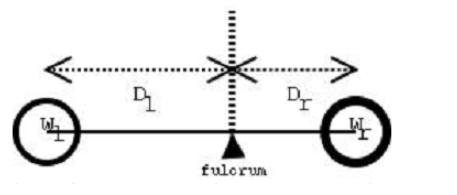
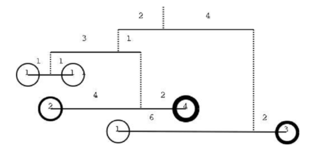

---
UVA839 - Not so Mobile
---

## Problem

https://onlinejudge.org/index.php?option=com_onlinejudge&Itemid=8&page=show_problem&problem=780

Before being an ubiquous communications gadget, a mobile was just a structure made of strings and wires suspending colourfull things. This kind of mobile is usually found hanging over cradles of small babies. The figure illustrates a simple mobile. It is just a wire, suspended by a string, with an object on each side. It can also be seen as a kind of lever with the fulcrum on the point where the string ties the wire. From the lever principle we know that to balance a simple mobile the product of the weight of the objects by their distance to the fulcrum must be equal. That is Wl × Dl = Wr × Dr where Dl is the left distance, Dr is the right distance, Wl is the left weight and Wr is the right weight. In a more complex mobile the object may be replaced by a sub-mobile, as shown in the next figure. In this case it is not so straightforward to check if the mobile is balanced so we need you to write a program that, given a description of a mobile as input, checks whether the mobile is in equilibrium or not.






> **题目大意：给出每个支点的左右物体重量和到支点的距离，`wl,dl,wr,dr`分别表示左边物体重量和到左边的距离，右边物体重量和到右边的距离，当`wl*dl==wr*dr`成立时，说明杠杆平衡。忽略所有绳子和杠杆重量。**

## Sample Input

```
1
0 2 0 4
0 3 0 1
1 1 1 1
2 4 4 2
1 6 3 2


2

0 26 0 5
2 5 2 5
0 16 0 10
5 6 5 6
0 14 0 2
1 1 1 1
7 10 7 10

3 5 3 5

```

## Sample Output

```
YES


NO

YES
```

## Tag

- 二叉树
- 先序/后序遍历
- 递归

## Solution

> - 借鉴一位网友的想法，首先先序遍历建树，因为题目暗示了子天平这一概念，即让我们理解成子树
>   - 先序遍历首先确立根节点，其次是左子树与右子树
>   - 然后通过后序遍历，从下往上以此进行检索判断子树和最终树是否平衡
> - 题目理解：
>   - 有一处概念是说当Wl或Wr为0时，表示该“砝码”是一个子天平，我浏览参考代码和样例觉得此处的意思应该是说，如果两边重量有一个地方为0或者都不为0的时候说明他们就是一个叶子节点（没有下层分支了）
>   - 如果都为0，说明他们都有分支，先左后右

### Code

```c++
#include <bits/stdc++.h>
using namespace std;
struct TreeNode
{
    int Wl, Wr, Dl, Dr;
    TreeNode *left = NULL;
    TreeNode *right = NULL;
    TreeNode()
    {
        Wl = Wr = Dl = Dr = 0;
        left = NULL;
        right = NULL;
    }
    TreeNode(int Wl, int Wr, int Dl, int Dr)
    {
        this->Wl = Wl;
        this->Wr = Wr;
        this->Dl = Dl;
        this->Dr = Dr;
    }
};
string s;

TreeNode *buildTree()
{
    int Wl, Wr, Dl, Dr;
    bool flag = true;
    string line = "";
    if (!getline(cin, line))
        flag = false;
    stringstream ss(line);
    ss >> Wl >> Dl >> Wr >> Dr;
    TreeNode *root = NULL;
    if (flag) // 读入成功
    {
        root = new TreeNode;
        root->Wl = Wl;
        root->Wr = Wr;
        root->Dl = Dl;
        root->Dr = Dr;
        if (!Wl)
            root->left = buildTree();
        if (!Wr)
            root->right = buildTree();
    }
    return root;
}
int dfs(TreeNode *root)
{
    if (root == NULL)
        return -1;  // 空树
    if (root->left) //左子树不为空
        root->Wl = dfs(root->left);
    if (root->right) // 右子树不为空
        root->Wr = dfs(root->right);
    if (root->Wl == -1 || root->Wr == -1) // 剪纸，发生了不平衡性，无需再遍历
        return -1;
    if (root->Wl * root->Dl == root->Wr * root->Dr) // 没有左右子树，计算其平衡性
        return root->Wl + root->Wr;                 // 返回左右子树的重量和
    else
        return -1;
}
int main(int argc, char const *argv[])
{
    int T;
    scanf("%d  ", &T);
    for (int i = 0; i < T; i ++) {
        TreeNode* bt = buildTree();
        printf("%s%s\n", dfs(bt) != -1 ? "YES" : "NO", i != T-1 ? "\n" : "");
        if (i != T-1) getchar(); // 空行吸收
    }

    return 0;
}

```

### Complexity Analysis

- 时间复杂度：O(NlogN)
- 空间复杂度：O(N)


### **Reference Code**

```c++
// UVa839 Not so Mobile
// Rujia Liu
// 题意：输入一个树状天平，根据力矩相等原则判断是否平衡。采用递归方式输入，0表示中间结点
// 算法：在“建树”时直接读入并判断，并且无须把树保存下来
#include<iostream>
using namespace std;

// 输入一个子天平，返回子天平是否平衡，参数W修改为子天平的总重量
bool solve(int& W) {
  int W1, D1, W2, D2;
  bool b1 = true, b2 = true;
  cin >> W1 >> D1 >> W2 >> D2;
  if(!W1) b1 = solve(W1);
  if(!W2) b2 = solve(W2);
  W = W1 + W2;
  return b1 && b2 && (W1 * D1 == W2 * D2);
}

int main() {
  int T, W;
  cin >> T;
  while(T--) {
    if(solve(W)) cout << "YES\n"; else cout << "NO\n";
    if(T) cout << "\n";
  }
  return 0;
}

```

