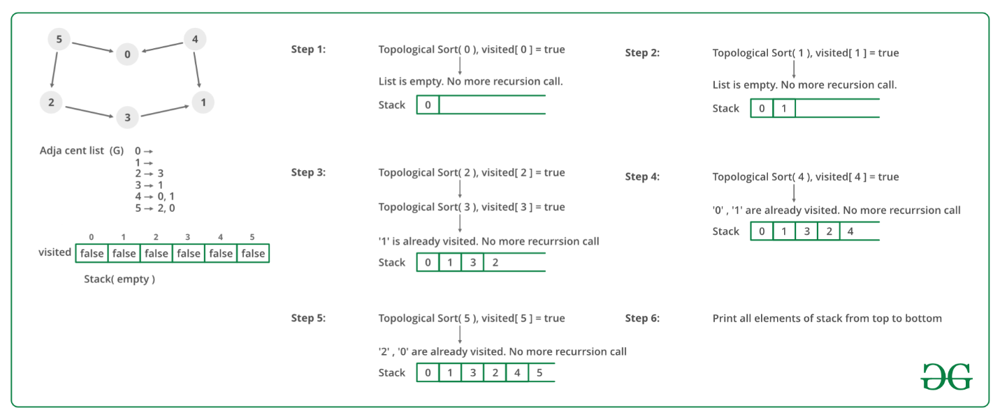

---
UVa10305 - Ordering Tasks
---

## Problem

https://vjudge.net/problem/UVA-10305

> **题目大意：给出有向无环图，输出拓扑排序（若有多个则任意输出一个）**

## Sample Input

```
The input will consist of several instances of the problem. Each instance begins with a line containing
two integers, 1 ≤ n ≤ 100 and m. n is the number of tasks (numbered from 1 to n) and m is the
number of direct precedence relations between tasks. After this, there will be m lines with two integers
i and j, representing the fact that task i must be executed before task j.
An instance with n = m = 0 will finish the input.

5 4
1 2
2 3
1 3
1 5
0 0
```

## Sample Output

```
For each instance, print a line with n integers representing the tasks in a possible order of execution.
1 4 2 5 3
```

## Tag

- 拓扑排序
- DFS

## Solution


> **有向无环图输出拓扑排序**
>
> - 从 DAG 图中选择一个没有前驱（即入度为 0）的顶点并输出。
> - 从图中删除该顶点和所有以它为起点的有向边。
> - 重复 1 和 2 直到当前的 DAG 图为空或**当前图中不存在无前驱的顶点为止**。后一种情况说明有向图中必然存在环。

### Code

```c++
// Zirui Hu
// 题意：输入n和m，以及m个二元组(i,j)，求1~n的一个排列使得对于每个(i,j)，i在j的前面
// 算法：拓扑排序。注意m可能等于0
#include <bits/stdc++.h>
using namespace std;
int m, n;

void Update(vector<int> &inDegree, queue<int> &q)
{
    for (size_t i = 1; i <= n; i++)
    {
        if (!inDegree[i])
        {                     // 没访问过
            q.push(i);        // 入队
            inDegree[i] = -1; // 标记为已访问
        }
    }
}

int main(int argc, char const *argv[])
{
    while (cin >> n >> m && (n != 0 || m != 0))
    {
        int u, v;
        vector<vector<int>> adj(n + 1); //邻接矩阵
        vector<int> inDegree(n + 1);    //每个点的入度数组
        vector<int> ans;         //结果数组
        while (m--)
        {
            cin >> u >> v;
            adj[u].push_back(v);
            inDegree[v]++;
        }
        queue<int> q;
        Update(inDegree, q);
        while (!q.empty())
        {
            int val1 = q.front();
            q.pop();
            ans.push_back(val1);
            for (int val2 : adj[val1])
            {
                inDegree[val2]--;
                if (!inDegree[val2])
                {
                    q.push(val2);
                    inDegree[val2] = -1;
                }
            }
        }
        for (size_t i = 0; i < ans.size(); i++)
            printf("%d%s", ans[i], i == ans.size() - 1 ? "\n" : " ");
    }
    return 0;
}

```

### Complexity Analysis

- 时间复杂度：O(n+E)
- 空间复杂度：O(n)


### **Reference Code**

https://www.geeksforgeeks.org/topological-sorting/

> **Algorithm to find Topological Sorting:** 
>
> We recommend to first see the implementation of [DFS](https://www.geeksforgeeks.org/depth-first-traversal-for-a-graph/). We can modify [DFS ](https://www.geeksforgeeks.org/depth-first-traversal-for-a-graph/)to find Topological Sorting of a graph. In [DFS](https://www.geeksforgeeks.org/depth-first-traversal-for-a-graph/), we start from a vertex, we first print it and then recursively call DFS for its adjacent vertices. In topological sorting, we use a temporary stack. We don’t print the vertex immediately, we first recursively call topological sorting for all its adjacent vertices, then push it to a stack. Finally, print contents of the stack. Note that a vertex is pushed to stack only when all of its adjacent vertices (and their adjacent vertices and so on) are already in the stack. 
>
> Below image is an illustration of the above approach:



```c++
// UVa10305 Ordering Tasks
// Rujia Liu
// 题意：输入n和m，以及m个二元组(i,j)，求1~n的一个排列使得对于每个(i,j)，i在j的前面
// 算法：拓扑排序。注意m可能等于0
#include<cstdio>
#include<cstring>
const int maxn = 1000;
int n, m, G[maxn][maxn], c[maxn], topo[maxn], t;

bool dfs(int u){
  c[u] = -1;
  for(int v = 0; v < n; v++) if(G[u][v]) {
    if(c[v]<0) return false;
    else if(!c[v]) dfs(v);
  }
  c[u] = 1; topo[--t]=u;
  return true;
}

bool toposort(){
  t = n;
  memset(c, 0, sizeof(c));
  for(int u = 0; u < n; u++) if(!c[u])
    if(!dfs(u)) return false;
  return true;
}

int main() {
  while(scanf("%d%d", &n, &m) == 2 && n) {
    memset(G, 0, sizeof(G));
    for(int i = 0; i < m; i++) {
      int u, v;
      scanf("%d%d", &u, &v); u--; v--;
      G[u][v] = 1;
    }
    if(toposort()) {
      for(int i = 0; i < n-1; i++)
        printf("%d ", topo[i]+1);
      printf("%d\n", topo[n-1]+1);
    }
    else
      printf("No\n"); // 题目没说无解输出什么，应该是保证有解吧
  }
}

```

