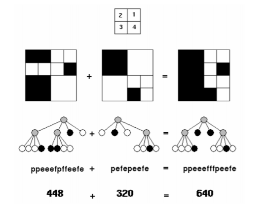

---
UVa297 - Quadtrees
---

## Problem

https://vjudge.net/problem/UVA-297

A quadtree is a representation format used to encode images. The fundamental idea behind the quadtree is that any image can be split into four quadrants. Each quadrant may again be split in four sub quadrants, etc. In the quadtree, the image is represented by a parent node, while the four quadrants are represented by four child nodes, in a predetermined order. 

Of course, if the whole image is a single color, it can be represented by a quadtree consisting of a single node. In general, a quadrant needs only to be subdivided if it consists of pixels of different colors. As a result, the quadtree need not be of uniform depth. 

A modern computer artist works with black-and-white images of 32 × 32 units, for a total of 1024 pixels per image. One of the operations he performs is adding two images together, to form a new image. In the resulting image a pixel is black if it was black in at least one of the component images, otherwise it is white. 

This particular artist believes in what he calls the preferred fullness: for an image to be interesting (i.e. to sell for big bucks) the most important property is the number of filled (black) pixels in the image. So, before adding two images together, he would like to know how many pixels will be black in the resulting image. Your job is to write a program that, given the quadtree representation of two images, calculates the number of pixels that are black in the image, which is the result of adding the two images together. 

In the figure, the first example is shown (from top to bottom) as image, quadtree, pre-order string (defined below) and number of pixels. The quadrant numbering is shown at the top of the figure.

> ### 题目大意
>
> 一个四叉树有三类节点，即父结点（P），黑色叶子（f），白色叶子（e）
>
> 现给出两个四叉树，求合并后黑色像素个数。
>
> 

## Sample Input

```c++
The first line of input specifies the number of test cases (N) your program has to process.
The input for each test case is two strings, each string on its own line. The string is the pre-order
representation of a quadtree, in which the letter ‘p’ indicates a parent node, the letter ‘f’ (full) a black
quadrant and the letter ‘e’ (empty) a white quadrant. It is guaranteed that each string represents a
valid quadtree, while the depth of the tree is not more than 5 (because each pixel has only one color).
    
3
ppeeefpffeefe
pefepeefe
peeef
peefe
peeef
peepefefe
```

## Sample Output

```
For each test case, print on one line the text ‘There are X black pixels.’, where X is the number
of black pixels in the resulting image

There are 640 black pixels.
There are 512 black pixels.
There are 384 black pixels.
```

## Tag

- 二叉树
- 递归
- 四叉树转二维数组合并；
- 隐式建树；

## Solution

> - 输入为四叉树的先序序列，因此先序递归建树很容易，但关键在于如何合并两棵四叉树，计算黑色个数。
>
>   -  尝试1：想同步层次/先序遍历两个四叉树，然后统计黑色个数，可惜两个树结构不完全一致，实现有些困难
>   -  尝试2：将四叉树转换为原图片的二维矩阵，然后用标记的方式来统计黑色个数，正解
>      尝试2的思路很有启发性，对于复杂的树/图结构，可以转换为规则的一维/二维数组，便于做各种计算
>
>   因此可以不用真正建立四叉树（类似UVA839，UVA699，隐式建树），在转换为原图二维矩阵时，可借用哈希的思想（空间换时间），遇见黑色就将整个正方形中的小格子全标记为黑色，因此可以直接统计黑色个数。
>
>   https://blog.csdn.net/qq_40738840/article/details/104321761
>
> -  四分树很特别的一点在于其一次先序遍历就能确定整棵树，原因在于灰色节点表示父节点，如果某个节点是灰色节点，那么它势必还有子节点标注四个小格子里的黑白分布情况，想反，如果是黑色/白色节点，则其必然是叶子节点，因为说明了4个小格都是黑/白

### Code

```c++
#include <bits/stdc++.h>
using namespace std;
int cnt, img[1025][1025] = {0}, idx;

void draw(string s, int &idx, int row, int col, int width)
{
    char ch = s[idx++]; // 获取当前字符
    if (ch == 'p')      // 如果是灰色，即按顺序递归处理四个区域
    {
        draw(s, idx, row, col + width >> 1, width >> 1);
        draw(s, idx, row, col, width >> 1);
        draw(s, idx, row + width >> 1, col, width >> 1);
        draw(s, idx, row + width >> 1, col + width >> 1, width >> 1);
    }
    else if (ch == 'f') // 如果是黑色，则计数
    {
        for (size_t i = row; i < row + width; i++)
        {
            for (size_t j = col; j < col + width; j++)
            {
                if (img[i][j] == 0)
                {
                    img[i][j] = 1;
                    ++cnt;
                }
            }
        }
    }
}

int main(int argc, char const *argv[])
{
    int T;
    cin >> T;
    string s1, s2;
    while (T--)
    {
        memset(img, 0, sizeof(img));
        cin >> s1 >> s2;
        cnt = 0;
        draw(s1, idx = 0, 0, 0, 32); // 1024=32*32个格子
        draw(s2, idx = 0, 0, 0, 32); // 注意初始化idx=0
        printf("There are %d black pixels.\n", cnt);
    }
    return 0;
}

```

### Complexity Analysis

- 时间复杂度：O(N²)
- 空间复杂度：O(N)


