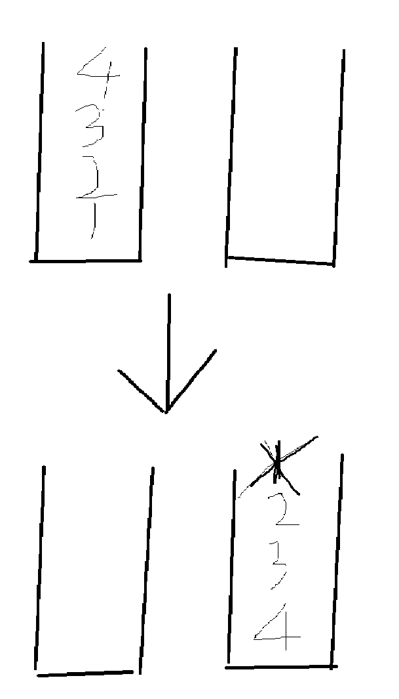

## 3 无重复字符的最长子串
> 3/28
* 滑动窗口

* $ $ $ $ $ $ $ $ $ $

* L       R

* ```java
  new hashset;
  while(R < str.length)
  	if(R not in hashset)
  		hashset.add(R);
  		R右移；
  	else
  		更新maxsize；
  		hashset.remove(L);
  		L右移;
  更新maxsize  //防止最大长度子串的R在最后一个字符
  return maxsize
  ```


## 5 最长回文子串
> 3/28
* 动态规划

* $dp[i][j] = dp[i+1][j-1] \  \wedge \ (s[i]==s[j])$

* 一列列进行动态规划 （$j-i==1$时额外判断）

  * |      | 0    | 1     | 2     | 3     |
    | ---- | ---- | ----- | ----- | ----- |
    | 0    | T    | ==1== | ==2== | ==4== |
    | 1    | ×    | T     | ==3== | ==5== |
    | 2    | ×    | ×     | T     | ==6== |
    | 3    | ×    | ×     | ×     | T     |


## 剑指 Offer 09. 用两个栈实现队列

> 3/29

* 两个栈 ，一个入队，一个辅助删除
* 


## 剑指 Offer 22. 链表中倒数第k个节点

> 3/29

* 弱智题


## 200. 岛屿数量

> 3/30

* dfs
* 遇到1做一次dfs，把读到的1全部变成0